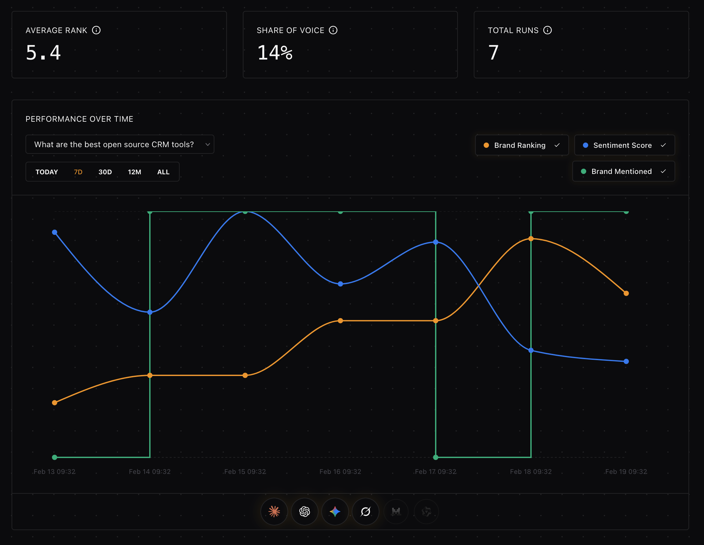

# Sonde

People are finding products through AI instead of search engines. Sonde helps you understand how your brand, product, or service appears in those responses. Across multiple models, over time.



Sonde tracks:

- **Visibility** – Are you being mentioned?
- **Sentiment** – How are you described?
- **Ranking** – How do you compare against competitors?

Instead of guessing whether your content or SEO efforts are working, Sonde gives you a concrete KPI to measure and optimize.

## Quick Start (Local or VPS)

Sonde is designed to run via **Docker Compose**.

## Prerequisites

- Docker
- Docker Compose v2 (`docker compose`)
- Git

Verify:

```bash
docker --version
docker compose version
```

⚠️ **Important**:
Prefer running Docker Compose as non-root unless required. For example, create a `deploy` user, assign it all files in the folder (`chown -R deploy:deploy .`) and switch to it before running services (`su deploy`).

## Setup

Clone the repository:

```bash
git clone https://github.com/compiuta-origin/sonde.git
cd sonde/docker
```

Create your environment file:

```bash
cp .env.example .env
```

Generate secure secrets:

```bash
./utils/generate-keys.sh
```

This will overwrite secret values inside `.env` with secure random keys.

## Configuration

Edit `.env` to fill in the required external service credentials:

### Required Keys

#### LLM access via OpenRouter

- `SYSTEM_OPENROUTER_KEY`

#### Stripe (for subscriptions)

- `STRIPE_API_KEY`
- `STRIPE_PUBLISHABLE_KEY`
- `STRIPE_WEBHOOK_SECRET`

#### Email server

- `SMTP_HOST`
- `SMTP_PORT`
- `SMTP_USER`
- `SMTP_PASSWORD`
- `SMTP_ADMIN_USER`

For production, also configure:

- `SITE_URL`
- `API_EXTERNAL_URL`

## Start Services

From the `docker/` directory:

```bash
docker compose up -d
```

### Access

You can now access both Sonde's UI and Supabase Studio:

- App: `SITE_URL` (default `http://app.localhost`)
- Supabase Studio: `API_EXTERNAL_URL` (default `http://api.localhost`). When accessing it, you'll be prompted for a user/password pair:
  - Default user: `supabase`
  - Password: see generated `.env`

⚠️ **Important**:
After logging into Supabase Studio, perform the following query to safely store your service role key:

```sql
SELECT vault.create_secret('your-service-role-key-value','service_role_key')
```

where `your-service-role-key-value` is the value associated to `SERVICE_ROLE_KEY` in your `.env` file.

You can double check the currently stored secred at any time with:

```sql
SELECT * from vault.decrypted_secrets
```

### Stopping Services

```bash
docker compose down
```

To remove volumes (⚠️ destroys database data):

```bash
docker compose down -v
```

### Updating Sonde

```bash
cd sonde
git pull
cd docker
docker compose pull
docker compose up -d --build
```

## Security Best Practices

### Keep secrets safe

The `generate-keys.sh` script creates:

- JWT secrets
- Database passwords
- Service keys

Never reuse these between environments. Never commit `.env`, store it in a safe place.

### Restrict Open Ports

Only expose:

- 80 (HTTP)
- 443 (HTTPS)
- 22 (SSH)

Your database and internal services must **not** be publicly accessible.

If on Ubuntu, you can use `ufw` (Uncomplicated Firewall).

#### Allow Required Ports

```bash
sudo ufw allow OpenSSH
sudo ufw allow 80/tcp
sudo ufw allow 443/tcp
```

#### Enable Firewall

```bash
sudo ufw enable
```

Check status:

```bash
sudo ufw status
```

You should see:

```
22/tcp   ALLOW
80/tcp   ALLOW
443/tcp  ALLOW
```

⚠️ **Important**:
Make sure SSH is allowed before enabling UFW, or you may lock yourself out.

## Managed version

For those who'd rather trade a small monthly fee for the convenience of a managed service, we offer a [hosted version](https://sondeanalytics.com).

## License

GNU AGPLv3.
